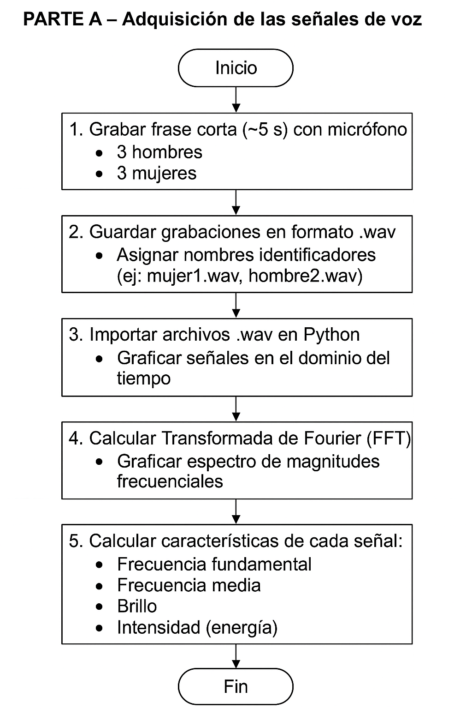
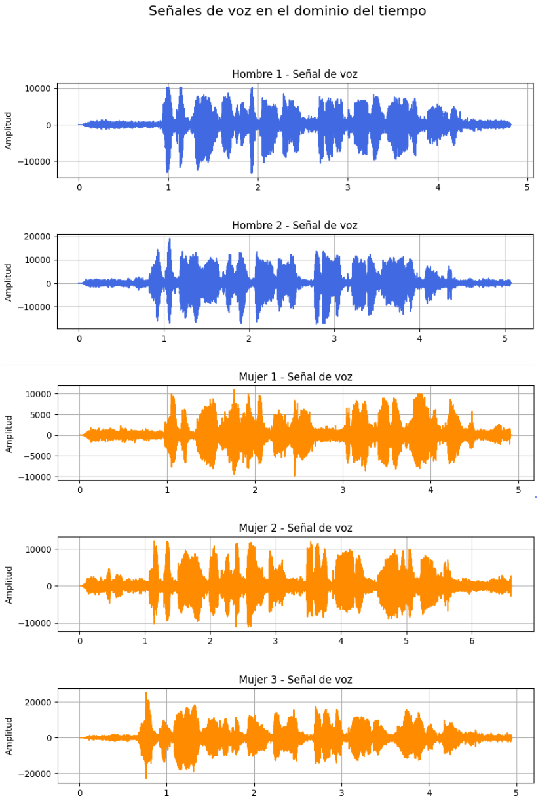
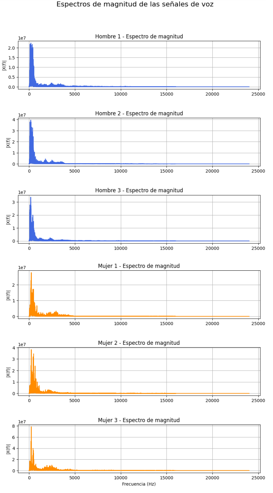
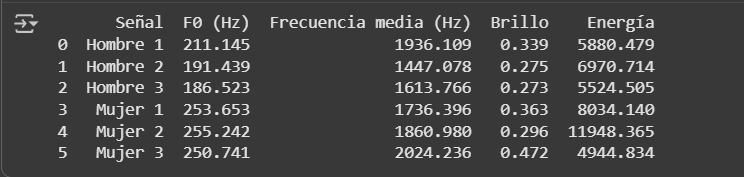
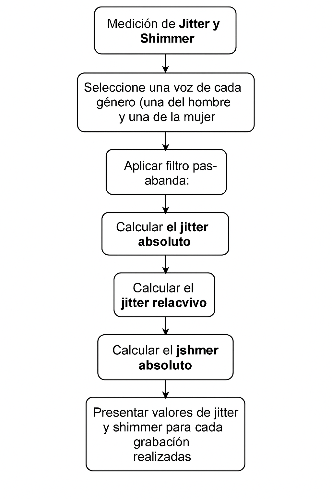

# Laboratorio-3-Procesamiento
## Introducción
En esta práctica de laboratorio se realizó la captura y el procesamiento de señales de voz con el propósito de analizar sus características espectrales. Para ello, se aplicó la Transformada de Fourier como herramienta fundamental de análisis en frecuencia, lo que permitió observar el comportamiento de las componentes espectrales de cada señal. Posteriormente, se extrajeron parámetros característicos de la voz como la frecuencia fundamental, frecuencia media, brillo, intensidad, jitter y shimmer, con el fin de cuantificar las diferencias acústicas entre ambos géneros. Finalmente, se compararon los resultados obtenidos entre las señales de voz de hombres y mujeres, permitiendo desarrollar conclusiones sobre el comportamiento espectral de la voz humana en función del género.
## Importación de librerias 
Para el desarrollo de esta práctica se instalaron las siguientes librerías:
            
```python
import wave 
import numpy as np
import matplotlib.pyplot as plt
import pandas as pd
from google.colab import files
from scipy.io import wavfile
          
```
La librería `wave` se utilizó para inspeccionar, leer, escribir y ver la duración y los canales de los archivos de audio `.wav`, al igual que `scipy.io.wavfile` que se usó para también leer las grabaciones de audio y además extraer la frecuencia de muestreo `sr` y los datos de la señal `y`. La librería `Numpy` fue escencial para trabajar con los arreglos de amplitudes y tiempos, detectar los cruces por cero (identificar periodos de vibración), y para aplicar las fórmulas del Jitter y Shimmer, sumando, promediando y restando elementos. `matplotlib.pyplot` y `pandas` sirvieron para la visualización de los resultados, tanto en gráficas como en tablas respectivamente. Y fiinalmente, `a`

## PARTE A

<p align="center">


En la parte inicial del laboratorio, se grabó con un micrófono de celular la misma frase corta "Lo que tienes, muchos lo pueden tener, pero lo que eres, nadie lo puede ser" en 6 personas distintas: 3 hombres y 3 mujeres. Para esto, se usó el micrófono de un teléfono para que las características de muestreo fueran las mismas para cada audio. Seguidamente, se guardó cada archivo de voz en formato `.wav`, se importaron estas señales en Google Colab y se graficaron en el dominio del tiempo de la siguiente manera: 

```python
# Lectura de cada archivo
sr1, y1 = wavfile.read('/content/drive/MyDrive/Hombre-1.wav')
sr2, y2 = wavfile.read('/content/drive/MyDrive/Hombre-2.wav')
sr3, y3 = wavfile.read('/content/drive/MyDrive/Hombre-3.wav')
sr4, y4 = wavfile.read('/content/drive/MyDrive/mujer1.wav')
sr5, y5 = wavfile.read('/content/drive/MyDrive/mujer-2.wav')
sr6, y6 = wavfile.read('/content/drive/MyDrive/mujer3.wav')

# Vectores de tiempo
t1 = np.linspace(0, len(y1)/sr1, num=len(y1))
t2 = np.linspace(0, len(y2)/sr2, num=len(y2))
t3 = np.linspace(0, len(y3)/sr3, num=len(y3))
t4 = np.linspace(0, len(y4)/sr4, num=len(y4))
t5 = np.linspace(0, len(y5)/sr5, num=len(y5))
t6 = np.linspace(0, len(y6)/sr6, num=len(y6))

# Gráficas
plt.figure(figsize=(10, 18))

plt.subplot(6, 1, 1)
plt.plot(t1, y1, color='royalblue')
plt.title("Hombre 1 - Señal de voz")
plt.ylabel("Amplitud")
plt.grid(True)

plt.subplot(6, 1, 2)
plt.plot(t2, y2, color='royalblue')
plt.title("Hombre 2 - Señal de voz")
plt.ylabel("Amplitud")
plt.grid(True)

plt.subplot(6, 1, 3)
plt.plot(t3, y3, color='royalblue')
plt.title("Hombre 3 - Señal de voz")
plt.ylabel("Amplitud")
plt.grid(True)

plt.subplot(6, 1, 4)
plt.plot(t4, y4, color='darkorange')
plt.title("Mujer 1 - Señal de voz")
plt.ylabel("Amplitud")
plt.grid(True)

plt.subplot(6, 1, 5)
plt.plot(t5, y5, color='darkorange')
plt.title("Mujer 2 - Señal de voz")
plt.ylabel("Amplitud")
plt.grid(True)

plt.subplot(6, 1, 6)
plt.plot(t6, y6, color='darkorange')
plt.title("Mujer 3 - Señal de voz")
plt.xlabel("Tiempo (s)")
plt.ylabel("Amplitud")
plt.grid(True)

plt.subplots_adjust(hspace=0.6)
plt.suptitle("Señales de voz en el dominio del tiempo", fontsize=16, y=0.95)
plt.show()         
```
Mostrando los siguientes resultados: 

<p align="center">


En cuanto al código, en "lectura de cada archivo" se cargan las grabaciones de voz (hombres y mujeres) con `wavfile.read` obteniendo la señal `y` y su frecuencia de muestreo `sr`. Después, en "Vectores de tiempo" se generan los vectores de tiempo para cada señal según su duración y frecuencia de muestreo con `np.linspace`. Luego se crean 6 gráficas, una por persona, mostrando la amplitud de la señal en función del tiempo. Finalmente se obtiene una imagen con todas las eñales de voz.

Después de este procedimiento, se calculó la Transformada de Fourier de cada señal para graficar su espectro de magnitudes frecuenciales de la siguiente manera: 

```python
# FFT de cada señal
Y1 = np.fft.fft(y1)
Y2 = np.fft.fft(y2)
Y3 = np.fft.fft(y3)
Y4 = np.fft.fft(y4)
Y5 = np.fft.fft(y5)
Y6 = np.fft.fft(y6)

# Magnitudes
mag1 = np.abs(Y1[:len(Y1)//2])
mag2 = np.abs(Y2[:len(Y2)//2])
mag3 = np.abs(Y3[:len(Y3)//2])
mag4 = np.abs(Y4[:len(Y4)//2])
mag5 = np.abs(Y5[:len(Y5)//2])
mag6 = np.abs(Y6[:len(Y6)//2])

# Frecuencia correspondiente
f1 = np.linspace(0, sr1/2, len(mag1))
f2 = np.linspace(0, sr2/2, len(mag2))
f3 = np.linspace(0, sr3/2, len(mag3))
f4 = np.linspace(0, sr4/2, len(mag4))
f5 = np.linspace(0, sr5/2, len(mag5))
f6 = np.linspace(0, sr6/2, len(mag6))

# Gráficas de los espectros
plt.figure(figsize=(10, 18))

plt.subplot(6, 1, 1)
plt.plot(f1, mag1, color='royalblue')
plt.title("Hombre 1 - Espectro de magnitud")
plt.ylabel("|X(f)|")
plt.grid(True)

plt.subplot(6, 1, 2)
plt.plot(f2, mag2, color='royalblue')
plt.title("Hombre 2 - Espectro de magnitud")
plt.ylabel("|X(f)|")
plt.grid(True)

plt.subplot(6, 1, 3)
plt.plot(f3, mag3, color='royalblue')
plt.title("Hombre 3 - Espectro de magnitud")
plt.ylabel("|X(f)|")
plt.grid(True)

plt.subplot(6, 1, 4)
plt.plot(f4, mag4, color='darkorange')
plt.title("Mujer 1 - Espectro de magnitud")
plt.ylabel("|X(f)|")
plt.grid(True)

plt.subplot(6, 1, 5)
plt.plot(f5, mag5, color='darkorange')
plt.title("Mujer 2 - Espectro de magnitud")
plt.ylabel("|X(f)|")
plt.grid(True)

plt.subplot(6, 1, 6)
plt.plot(f6, mag6, color='darkorange')
plt.title("Mujer 3 - Espectro de magnitud")
plt.xlabel("Frecuencia (Hz)")
plt.ylabel("|X(f)|")
plt.grid(True)

plt.subplots_adjust(hspace=0.6)
plt.suptitle("Espectros de magnitud de las señales de voz", fontsize=16, y=0.95)
plt.show()     
```

En este código, primero se aplica la Transformada Rápida de Fourier con `(np.fft.fft)` para convertir las señales de voz del dominio del tiempo al dominio de la frecuencia. Luego se obtiene la magnitud del espectro con `np.abs()` y se toma solo la mitad positiva porque el espectro de una señal real es simétrico, y esa parte ya contiene toda la información relevante sobre las frecuencias. Seguidamente se crea un vector de frecuencias (f1, f2, etc.) que va de 0 a la mitad de la frecuencia de muestreo `(sr/2)` y se dibujan los espectros de magnitud de las 6 señales (hombres en azul, mujeres en naranja) mostrando cómo se distribuye la energía en distintas frecuencias: 

<p align="center">


Para terminar la parte A, se identificaron las siguientes características de cada señal: Frecuencia fundamental, frecuencia media, brillo e intensidad (energía) así:

```python
# Función para calcular características
def analizar_senal(nombre, ruta):
    sr, y = wavfile.read(ruta)
    y = y / np.max(np.abs(y))  # normalizar
    N = len(y)
    Y = np.fft.fft(y)
    Y = np.abs(Y[:N//2])
    freqs = np.fft.fftfreq(N, 1/sr)[:N//2]

    # Frecuencia fundamental
    mask = (freqs > 50) & (freqs < 500)
    f0 = freqs[mask][np.argmax(Y[mask])]

    # Frecuencia media
    f_media = np.sum(freqs * Y) / np.sum(Y)

    # Brillo (porcentaje de energía >1500 Hz)
    brillo = np.sum(Y[freqs > 1500]) / np.sum(Y)

    # Energía (intensidad)
    energia = np.sum(y**2)

    return nombre, f0, f_media, brillo, energia

# Procesar todas las señales
resultados = [analizar_senal(nombre, ruta) for nombre, ruta in archivos]

# Mostrar resultados
df = pd.DataFrame(resultados, columns=['Señal', 'F0 (Hz)', 'Frecuencia media (Hz)', 'Brillo', 'Energía'])
print(df.round(3))         
```
La función `analizar_senal()` emplea `wavfile.read()` para leer los archivos `.wav`, obteniendo la frecuencia de muestreo `(sr)` y los datos de la señal `(y)`. Luego, con `Numpy`, se normaliza la señal dividiendo por su valor máximo `(y / np.max(np.abs(y)))` y se aplica la Transformada Rápida de Fourier mediante `np.fft.fft(y)` para pasar la señal al dominio de la frecuencia. Posteriormente, se generan los vectores de frecuencias con `np.fft.fftfreq()` y se calcula:

- La frecuencia fundamental (f₀) localizando el máximo valor del espectro en el rango de 50–500 Hz.
- La frecuencia media, usando la media ponderada de la energía `(np.sum(freqs * Y) / np.sum(Y))`.
- El brillo, midiendo la proporción de energía por encima de 1500 Hz.
- La energía total, calculada como la suma del cuadrado de las amplitudes `(np.sum(y**2))`.

Finalmente, los resultados de todas las señales se organizan en un DataFrame de pandas con `pd.DataFrame()`, lo que facilita su visualización y da como resultado la siguiente tabla:
<p align="center">



<p align="center">


# Parte B

Se carga el archivo `.wav` y se obtiene la frecuencia de muestreo (`fs`) y los datos de la señal (`data`). Si el audio es estéreo, se selecciona solo un canal para analizarlo.
```phyton
fs, data = wavfile.read('/content/drive/MyDrive/Hombre-1.wav')
```
Se define el rango de frecuencias típico de la voz masculina (80–400 Hz) y (150-500 Hz) de la voz femenina para eliminar ruido fuera de ese rango.
```phyton
lowcut = 80.0   # Voz masculina
highcut = 400.0
# Para voz femenina: lowcut = 150.0, highcut = 500.0
```


